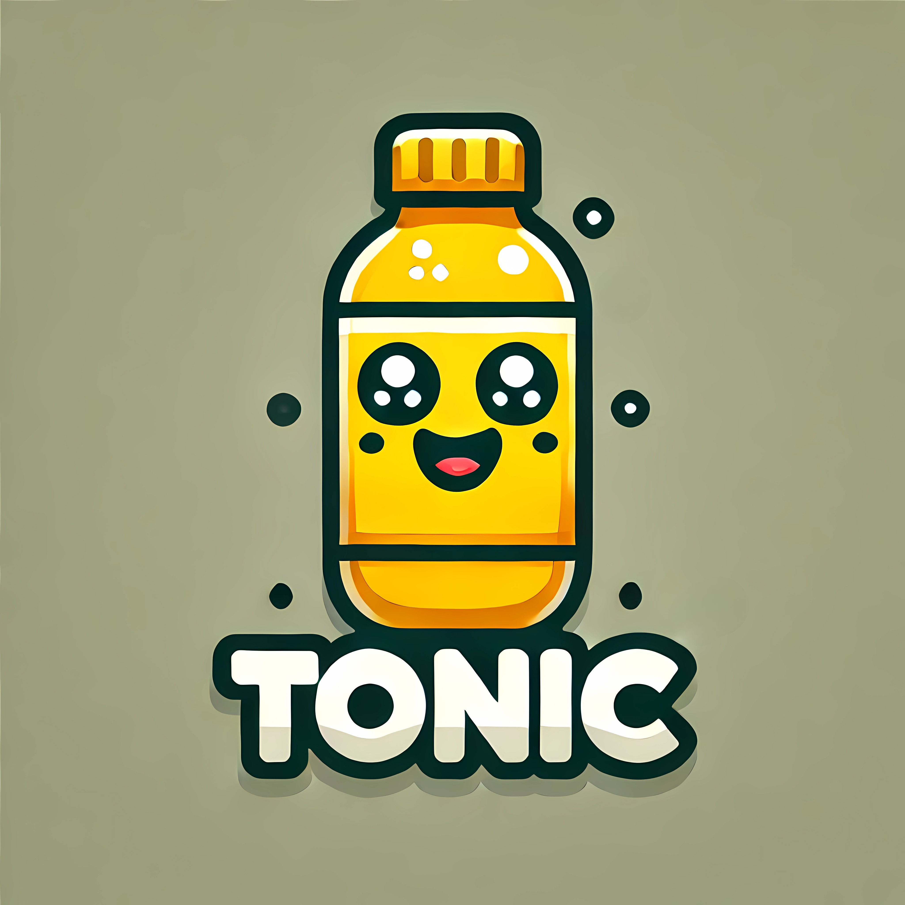
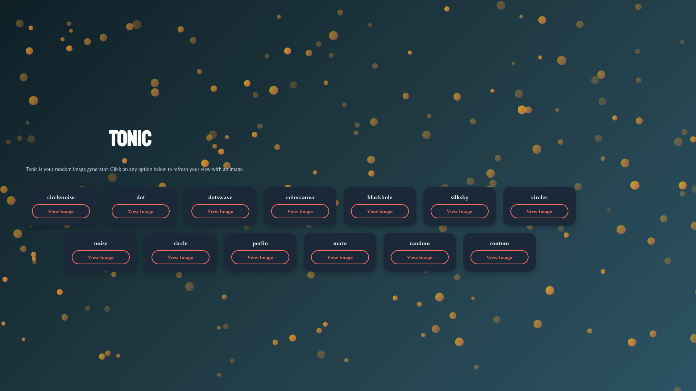
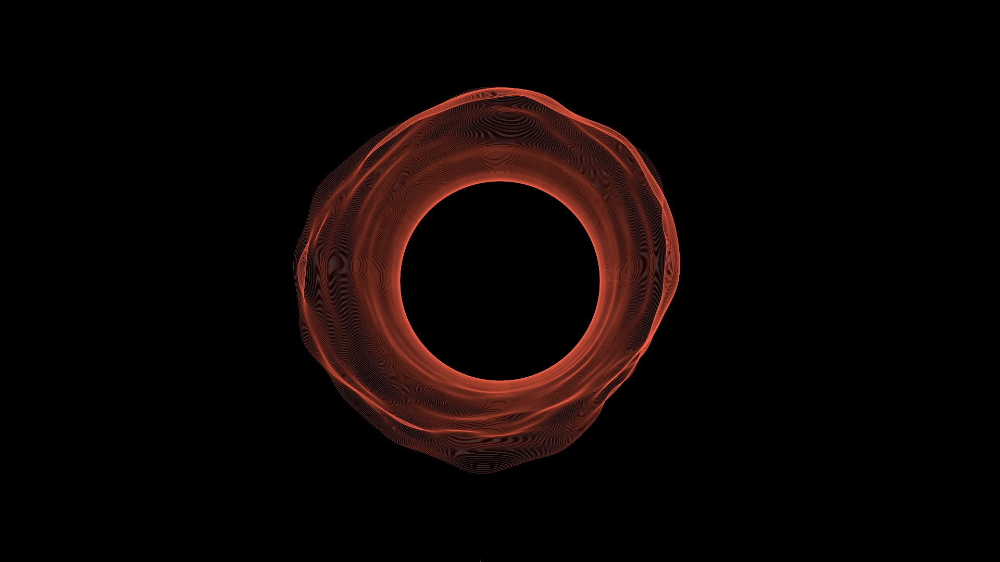

# Tonic


<a href="https://pkg.go.dev/github.com/duolok/tonic"></a>
<a href="https://github.com/duolok/tonic/actions"></a>

Tonic is a delightful, minimalistic, and easy-to-use image generator. It's designed with simplicity and flexibility in mind, offering a clean way to create generative art using intuitive, Go-based APIs.
Whether you're a seasoned developer or an artist, Tonic is here to help you generate unique pieces of art with minimal effort. 

This was a fun pet project I've written, but it will evolve as I get to refactor it later. <br><br><br>

## Features

- Intuitive Go-based API for creating generative art
- High-performance rendering with minimal dependencies
- Wide variety of artistic engines and tools to choose from
- Customizable color palettes, backgrounds, and line properties
- Supports exporting artwork as PNG files

## Getting Started

### Prerequisites

Tonic requires [Go](https://go.dev/) version 1.18 or higher.

### Installing Tonic

To install Tonic, use `go get` to add the package to your project:

```sh
go get -u github.com/duolok/tonic
```

Example Usage
A simple example to create an artwork using the "circles" generator:

```go
package main

import (
  "github.com/gin-gonic/gin"
  "github.com/duolok/tonic/generator"
  "net/http"
)

func main() {
  r := gin.Default()
  r.GET("/art/circles", func(c *gin.Context) {
    file := generator.DrawOne("circles")
    c.Header("Content-Type", "image/png")
    c.File(file)
  })
  r.Run()
}
```

To run the code, use:

```sh
go run main.go
```
Then, visit 0.0.0.0:8080/art/circles to see the generated artwork!

### Resources 
- Bubbles: Common UI components for terminal applications.
- Lip Gloss: Tools for styling and formatting terminal UIs.
- Termenv: Advanced ANSI styling.

### Gallery




